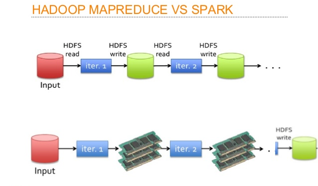
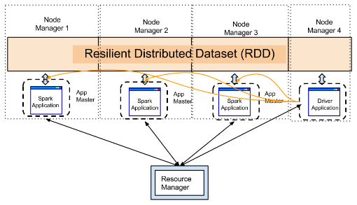

# Apache Spark Fundamentals
Apache spark is a
- general purpose
- in-memory
- compute engine

## Compute Engine
Hadoop provides 3 things
1. *HDFS* - for storage
2. *Map Reduce* - for computation
3. *YARN* - for resource management

**Spark is replacement or alternative of Map Reduce.** It is a plug and play compute engine which needs two things to work with:-
- *Storage* - local, HDFS, cloud storage (AWS S3), etc.
- *Resourse Manager* - YARN, Mesos, Kubernetes

## In-Memory
> For each Map Reduce job we require 2 disk access or I/O operations. One is for reading and other is for writing.
> In most of scenarios spark only requires 2 I/O operations throughout all jobs, thats why it is said to be 10 to 100 times faster than Map Reduce.

## General Porpose
> In hadoop we use various tools like pig for data cleaning, hive for querying, mahout for machine learning, sqoop for data ingestion.
> But, with spark we just need to learn only one style of writing the code and all the things like cleaning, quering, ML, data ingestion can happen with that.

## RDD (Resilient Distributed Dataset)
> The basic unit which holds data in spark is called as RDD.
> RDD is nothing but in-memory distributed collection.

### RDDs are :-
- Distributed in memory (as shown in above image)
- Resilient - if we lose a RDD then we can recover it back. RDD is resilient to failure or fault tolerance.\
RDD1 --transformation1--> RDD2 --transformation2--> RDD3 - if RDD3 is lost then it will check for its parent RDD using the lineage graph (DAG), & it will quickly apply transformation on parent RDD which is RDD2 here.
- Immutable - once we load RDD with data the data can not be changed. RDDs are immutable to be resilient or fault tolerance.

#### Basic Program in Spark
Step 1: rdd1 = load file1 from hdfs -> transformation\
Step 2: rdd2 = rdd1.map() -> transformation\
Step 3: rdd3 = rdd2.filter() -> transformation\
Step 4: rdd3.collect() -> action

##### There are two kinds of operations in spark
1. Transformations (these are lazy)
2. Actions (these are not lazy)

>Whenever we call transformations an entry to the execution plan is added.

>Transformations are lazy that means when we execute step1, step2, step3 no actual computation has happened but as diagram will be created in backend.
>This diagram is technically called as DAG (Directed Acyclic Graph).
> A DAG is generated when we compute spark statement. Execution happens when action is encountered before that only entries are made into DAG.
