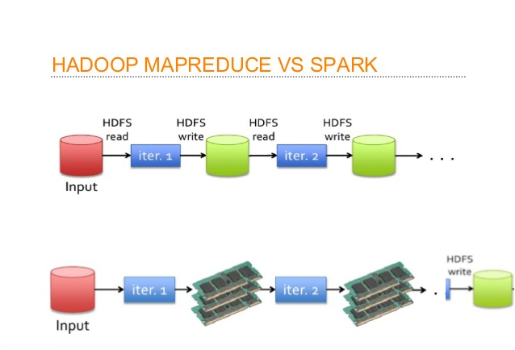
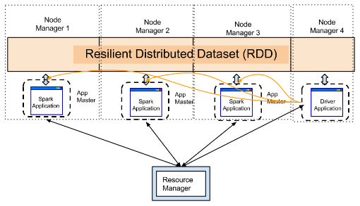

# Apache Spark Fundamentals
Apache spark is a
- general purpose
- in-memory
- compute engine

## Compute Engine
Hadoop provides 3 things
1. *HDFS* - for storage
2. *Map Reduce* - for computation
3. *YARN* - for resource management

**Spark is replacement or alternative of Map Reduce.** It is a plug and play compute engine which needs two things to work with:-
- *Storage* - local, HDFS, cloud storage (AWS S3), etc.
- *Resourse Manager* - YARN, Mesos, Kubernetes

## In-Memory
> For each Map Reduce job we require 2 disk access or I/O operations. One is for reading and other is for writing.
> In most of scenarios spark only requires 2 I/O operations throughout all jobs, thats why it is said to be 10 to 100 times faster than Map Reduce.

## General Porpose
> In hadoop we use various tools like pig for data cleaning, hive for querying, mahout for machine learning, sqoop for data ingestion.
> But, with spark we just need to learn only one style of writing the code and all the things like cleaning, quering, ML, data ingestion can happen with that.

> The basic unit which holds data in spark is called as RDD (Resilient Distributed Dataset).
> RDD is nothing but in-memory distributed collection.

